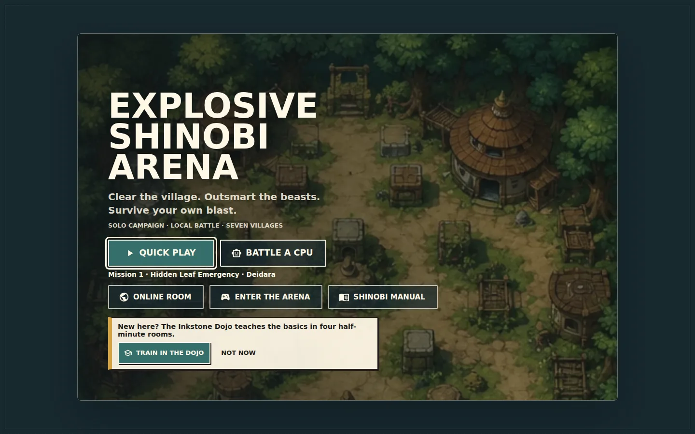
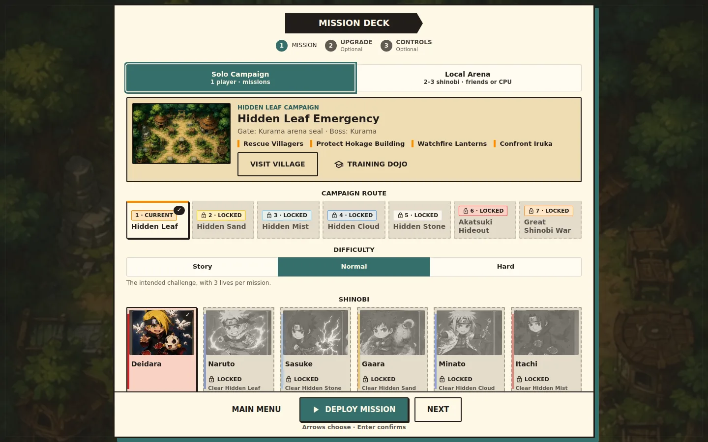
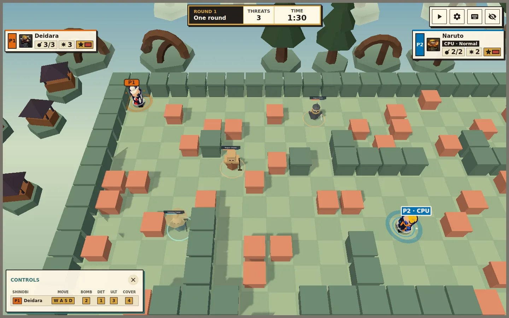
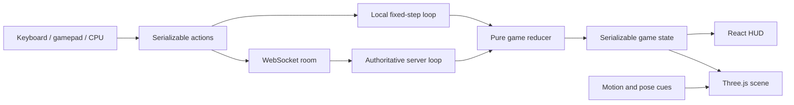

# Explosive Shinobi Arena

A fast 3D grid-bomber game with a shinobi-inspired campaign, couch battles,
CPU opponents, and private online rooms. Built for the browser with React,
TypeScript, and Three.js.

**[Play the game](https://bomberman-zuqb.onrender.com)**



## Features

- **Seven-stage solo campaign:** rescue villagers, defend structures, solve
  stage objectives, defeat guards, and seal tailed-beast bosses.
- **Local Arena:** two or three human or CPU players, best-of-1/3/5 matches,
  gamepads, rebindable controls, and sudden death.
- **Private online rooms:** two players share a room code, ready up, reconnect
  after a short interruption, and request a rematch.
- **Six distinct fighters:** each has a unique bomb, ultimate, passive, movement
  style, and visual effects.
- **Living stages:** fog of war, hidden rewards, village events, monsters,
  boss phases, and character-specific power-ups.
- **Training and accessibility:** four playable dojo lessons, reduced motion,
  high contrast, HUD scaling, captions, screen-shake controls, and low-scenery
  mode.
- **Deterministic simulation:** seeded matches support repeatable tests, CPU
  simulations, replays, and server-controlled online play.

## Screens

| Mission Deck | Live arena |
| --- | --- |
|  |  |

## How The 3D Models Were Made

The live characters are **procedural models**, not AI-generated 3D files. They
are built by the renderer at runtime:

1. A character definition supplies the palette, identity, abilities, and
   signature details.
2. Three.js primitives such as capsules, spheres, cones, and boxes form the
   body, hair, clothing, and accessories.
3. Repeated monster, boss, pickup, and landmark parts are transformed, merged,
   and cached. Fighters keep poseable groups and receive one merged outline.
4. A three-band toon ramp creates the cel-shaded look.
5. A second, back-facing hull expands in the vertex shader to draw the dark
   ink line around each fighter.
6. Render-only pose cues animate movement, bomb placement, hits, ultimates,
   and knockouts without changing game rules.

The AI-assisted art workflow stopped at 2D references and menu assets:

1. A brief described the minimal retro-anime mood, ink treatment, palette, and
   required composition.
2. Image variants were generated, reviewed, and selected by hand.
3. Selected images were cropped into the hero, roster, and stage artwork,
   compressed to WebP, and integrated manually.
4. The 3D silhouettes were then authored and tuned in Three.js from those
   references. No image-to-3D model or runtime AI is used.

The recipes live in `GameScene3D.tsx` and `src/view/GameScreen/scene/`.
Archived GLB experiments remain under `public/models/characters/`, but the
shipping renderer has their loading path disabled and uses procedural figures.

## How Performance Was Improved

Optimization followed a repeatable loop: **profile a production build, isolate
one bottleneck, change one system, measure again, then protect the behavior with
tests**. Development-mode frame rates were not used as performance evidence.

The largest changes were:

- A fixed 50 ms simulation runs outside React; display frames interpolate
  movement between simulation steps.
- Narrow store selectors stop the full scene and HUD from re-rendering on every
  clock tick.
- Floor tiles, walls, crates, hazards, tails, and landmarks use instancing.
  Geometry, materials, textures, and label sprites are shared and cached.
- Five reusable point lights keep the shader light count stable. All material
  variants are warmed during the countdown, avoiding shader compilation during
  combat.
- The canvas renders on demand while paused, caps device pixel ratio at 1.35,
  and disables antialiasing.
- The 3D match is lazy-loaded; the title screen paints before the Three.js
  bundle is needed.
- Seeded CPU matches, reducer tests, render tests, and Playwright production
  smoke tests catch regressions.

Recorded project profiling reduced a versus map from **445 to 115 draw calls**,
scene updates from roughly **30 to 5-7 components per simulation tick**, and
removed late shader compiles after a round becomes playable. Exact timings vary
by browser and hardware.

## System Design



Campaign, training, and local battles run the reducer in the browser. Online
rooms run the same rules on the server; browsers send player intent and receive
validated snapshots. The renderer never owns gameplay state, so visual
animation cannot change a match outcome.

Read [the system design](docs/ARCHITECTURE.md) for state ownership, the online
room lifecycle, rendering boundaries, and performance constraints.

## Run Locally

Use Node.js 22.

```bash
npm install
npm start
```

For private online rooms, run the server in a second terminal:

```bash
npm run server
```

Open `/online` in two browser windows. The local server listens on
`ws://127.0.0.1:8787`. Production builds read `VITE_GAME_SERVER_URL`;
`render.yaml` connects the static site to the WebSocket service.

## Checks

```bash
npm run lint
npm test
npm run build
npm run test:e2e
```

## Project Map

| Path | Purpose |
| --- | --- |
| `src/engine/` | Pure simulation, rules, AI hazards, campaign, and seeded randomness |
| `src/content/` | Fighters, stages, missions, enemies, bosses, and power-ups |
| `src/hooks/` | Fixed-step loop, state stores, interpolation, and React bridges |
| `src/network/` | Protocol validation, snapshots, reconnects, and replays |
| `src/view/GameScreen/` | HUD and React Three Fiber renderer |
| `server/` | Authoritative two-player rooms and health endpoint |
| `public/maps/` | Stage layouts |

## License

MIT. This is an independent fan project; no affiliation or endorsement is
implied.
