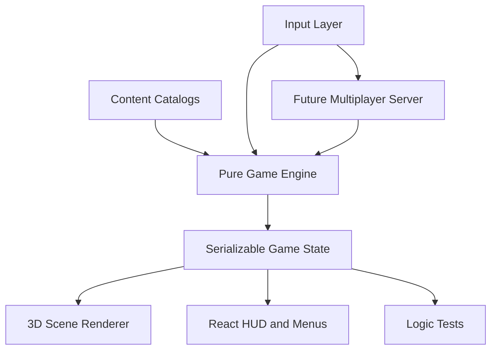

# Explosive Shinobi Arena Architecture

## Overview

The game uses a **pure game engine** (`src/engine/`) separated from React UI, content catalogs, and the 3D renderer. Input flows into serializable actions, the engine reducer produces deterministic state, and views subscribe to that state. This keeps solo boss mode, local arena mode, replays, and future online rooms on the same simulation foundation.

## Directory Layout

| Path | Responsibility |
|------|----------------|
| `src/engine/` | Serializable state, pure reducer, tick loop, map, beast, boss, hazard, and bomb logic |
| `src/content/` | Character, stage, boss, and power-up definitions |
| `src/story/` | Local story progress, unlock rewards, and selected upgrade persistence |
| `src/hooks/useGameEngine.ts` | React bridge: keyboard input, game loop, reducer dispatch |
| `src/input/` | Controller abstraction that maps input state to engine actions |
| `src/view/GameScreen/GameScene3D.tsx` | React Three Fiber arena renderer |
| `src/view/GameScreen/GameHUD.tsx` | In-game HUD for loadouts, ultimates, boss health, and danger zones |
| `src/network/` | Network message types and local replay helpers for future online play |
| `src/view/*` | Welcome, instructions, configuration, and game screens |
| `public/maps/` | Text map layouts for village stages |

## State Flow

1. **Init** – `ConfigScreen` stores mode, stage, loadout, upgrade, map, and key bindings; `GameScreen` dispatches `INIT` with the selected config.
2. **Input** – `HumanController` maps keyboard input to `MOVE`, `DROP_BOMB`, and `USE_ULTIMATE` actions.
3. **Tick** – `requestAnimationFrame` accumulates delta time; every ~50ms dispatches `TICK`.
4. **Simulation** – The reducer advances players, beasts, bombs, boss movement, boss casts, hazards, cooldowns, and win conditions.
5. **Render** – `GameScene3D` reads `GameEngineState` and draws walls, boxes, character billboards, bombs, explosions, beasts, bosses, and hazards.
6. **Trial end** – Engine sets `phase` to `round_end` or `game_over`; UI shows the result dialog and story rewards can be saved.

## Coordinate System

- Grid uses `map[y][x]` (row = y, column = x).
- Player positions are integer cell coordinates.
- 3D scene maps `(x, y)` → `(x, 0, y)` with Y-up.

## Character Bombs and Bosses

Character behavior is content-driven where possible and engine-driven where simulation rules are needed:

- `src/content/characters.ts` exposes names, titles, colors, bomb labels, ultimate labels, and descriptions.
- `src/engine/bombs.ts` maps characters to concrete bomb kinds and applies different blast shapes, damage, and boss-control effects.
- `src/content/bosses.ts` and `src/engine/bosses.ts` pair boss catalog data with movement, warning windows, hazards, phases, and cooldown tuning.
- `ExplosionCell.kind` lets the renderer color and animate blasts by the bomb that created them.

## Legacy Issues Fixed in Engine

- Mutable `Player` class instances mixed with React state.
- `setTimeout` for bombs/explosions (non-deterministic).
- `SmartMonster.getNeighbors` indexed `map[x][y]` instead of `map[y][x]`.
- `GameScreen.tsx` mixed UI, timers, spawning, and win detection.
- Cell-by-cell rendering made movement look stiff; render-side interpolation now smooths entity motion.

## Future Multiplayer

Engine actions in `src/engine/actions.ts` and messages in `src/network/types.ts` are JSON-serializable. A future WebSocket server can run the same reducer authoritatively; clients send input actions and room selections, then receive state snapshots.
