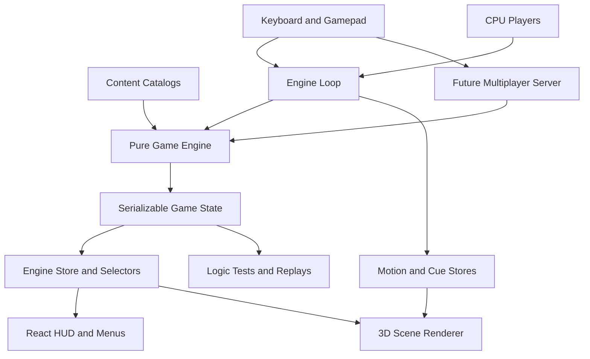

# Explosive Shinobi Arena Architecture

## Overview

The game uses a **pure game engine** (`src/engine/`) separated from React UI, content catalogs, and the 3D renderer.
- Input, from keyboards, gamepads and CPU players, flows into serializable actions.
- A fixed-step loop runs the reducer outside React.
- The views read the resulting state through narrow subscriptions.

Solo campaign, Local Arena, replays, and future online rooms all share this simulation.

```mermaid
flowchart TD
  contentCatalogs[Content Catalogs] --> gameEngine[Pure Game Engine]
  inputLayer[Keyboard and Gamepad] --> engineLoop[Engine Loop]
  cpuPlayers[CPU Players] --> engineLoop
  engineLoop --> gameEngine
  gameEngine --> gameState[Serializable Game State]
  engineLoop --> motionCues[Motion and Cue Stores]
  gameState --> engineStore[Engine Store and Selectors]
  engineStore --> hudUi[React HUD and Menus]
  engineStore --> threeScene[3D Scene Renderer]
  motionCues --> threeScene
  gameState --> tests[Logic Tests and Replays]
  futureNetwork[Future Multiplayer Server] --> gameEngine
  inputLayer --> futureNetwork
```

## Directory Layout

| Path | Responsibility |
| --- | --- |
| `src/engine/` | Serializable state and the pure reducer: players, bombs, flames, monsters, bosses, hazards, campaign, fog of war, sudden death, seeded randomness (`random.ts`) |
| `src/ai/` | CPU players: think after each tick, steer each frame, act only through engine actions |
| `src/hooks/engineLoop.ts` | Fixed-step simulation loop outside React, held-movement repeats, CPU thinking, motion and cue recording |
| `src/hooks/engineStore.ts` | Store over the engine loop, with `useEngineSelector` for narrow React subscriptions |
| `src/hooks/useRenderState.ts` | Scene and HUD states that keep their identity across clock-only ticks |
| `src/hooks/motionStore.ts`, `cueStore.ts` | Per-step motion tracks and render-only pose cues for the 3D scene |
| `src/hooks/useGameEngine.ts` | React bridge: keyboard input, pad bindings, engine store |
| `src/input/` | Key bindings, the shared gamepad poll (`padHub.ts`), and gamepad menu navigation |
| `src/content/` | Character, stage, stage look, enemy, boss, campaign, and power-up definitions |
| `src/story/` | Saved campaign progress and unlocks |
| `src/network/` | Replay helpers (`REPLAY_VERSION`) and message types for future online play |
| `src/view/GameScreen/GameScreen.tsx` | Match screen: pause, confirmations, result hold, captions, gamepad claim |
| `src/view/GameScreen/GameScene3D.tsx` | React Three Fiber arena renderer |
| `src/view/GameScreen/scene/` | Light pool, shader warmup, instanced tiles, camera framing, stage atmosphere and landmarks, figures, ink outlines, hazard telegraphs, cue poses |
| `src/view/GameScreen/GameHUD.tsx` | In-game HUD: player cards, match bar, campaign panel |
| `src/view/*` | Welcome, Mission Deck setup, Shinobi Manual, and game screens |
| `public/maps/` | Text map layouts for the stages; they are bundled into the build |

## State Flow

1. **Init.**
   - The Mission Deck (`ConfigScreen`) stores mode, stage, characters, CPU seats, round count, upgrade, and key bindings.
   - `GameScreen` builds a `GameConfig` and dispatches `INIT` with a seed.
   - The match code is a lazy chunk that the menus prefetch.
2. **Countdown.** The 3-2-1 countdown freezes the simulation: the reducer rejects actions until the round is live. Every material variant compiles during this window.
3. **Input.**
   - A key press sends `MOVE` at once. Holding the key repeats it from the engine loop every 28 ms (18 ms for Minato or with a speed boost), in 0.1-cell steps, with buffered turns at intersections.
   - Bombs, detonations, ultimates, and cover are single actions.
   - Gamepads press the same bindings: the n-th pad plays the n-th human seat.
4. **Tick.** The loop accumulates frame time, capped at 100 ms, and runs up to four 50 ms `TICK`s per frame.
   - After each tick, CPU players may act through the same actions a human would.
   - The reducer advances players, bombs, flames, monsters, bosses, hazards, objectives, fog of war, the round clock, and sudden death.
5. **Publish.** The engine store notifies subscribers once per frame.
   - The scene and HUD get states that stay the same object until something they draw changes.
   - Clock-only ticks reach only the components that print a clock or countdown.
6. **Render.**
   - `GameScene3D` draws the board from the scene state.
   - Each frame it samples the motion store for smooth fighter movement and the cue store for poses.
   - It reads the live engine state for fuses and flames.
7. **Round end.**
   - The engine sets `phase` to `round_end` or `game_over` and pauses.
   - The screen holds the deciding moment for 1.2 s, then shows the result. The result ignores input for its first 600 ms.
   - `DISMISS_DIALOG` starts the next round, and `RESTART` rematches with a fresh seed.

## Render Pipeline

- **Canvas.**
  - Antialiasing is off, the device pixel ratio is capped at 1.35, and the canvas is transparent over a CSS sky gradient.
  - The frame loop switches to on-demand under a real pause or the result dialog.
- **Lights.** Per stage, one ambient, one hemisphere, and one directional light are recoloured. Dynamic lights come from a fixed pool of five point lights (`LightPool.tsx`). The light count never changes, because three.js recompiles every lit material when it does.
- **Warmup.** `ShaderWarmup.tsx` compiles every material variant during the countdown, with the scene fog attached. The variants include toon fighters, Ghost, ink outlines, telegraphs, and labels. A variant missing from the warmup would compile mid-match and stutter.
- **Static board.**
  - Floor, walls, and crates are instanced layers (`StaticTiles.tsx`).
  - Off-grid landmarks reuse the same program and stay outside every legal camera framing. The Stage scenery setting can hide them.
- **Entities.**
  - Fighters are procedural figures with shared toon materials and one merged ink-outline mesh each.
  - Monsters and bosses use shared module-level geometry and materials per archetype.
  - Labels and tags share sprite textures.
- **Camera.** The camera fits the players' box against the measured HUD bands (`cameraFraming.ts`). Narrow screens may zoom out far enough for the widest legal spread of players.
- **Accessibility.** High contrast retones palettes and material uniforms, with no CSS filter on the canvas. Reduced motion holds poses still and turns off camera shake.

## Coordinate System

- The grid uses `map[y][x]` (row = y, column = x).
- Player positions are decimal cell coordinates that move in 0.1-cell steps. Bombs, flames, and pickups stay on whole cells.
- The 3D scene maps `(x, y)` to `(x, 0, y)` with Y up.

## Character Bombs and Bosses

Character behavior is content-driven where possible and engine-driven where simulation rules are needed:

- `src/content/characters.ts` exposes names, titles, colors, bomb labels, ultimate labels, and descriptions.
- `src/engine/bombs.ts` maps characters to concrete bomb kinds and applies different blast shapes, damage, and boss-control effects.
- `src/content/bosses.ts` and `src/engine/bosses.ts` pair boss catalog data with movement, warning windows, hazards, phases, and cooldown tuning.
- `ExplosionCell.kind` lets the renderer color and animate blasts by the bomb that created them.

## Legacy Issues Fixed in Engine

- Mutable `Player` class instances mixed with React state.
- `setTimeout` for bombs/explosions (non-deterministic).
- `SmartMonster.getNeighbors` indexed `map[x][y]` instead of `map[y][x]`.
- `GameScreen.tsx` mixed UI, timers, spawning, and win detection.
- Cell-by-cell rendering made movement look stiff; render-side interpolation now smooths entity motion.

## Future Multiplayer

Engine actions in `src/engine/actions.ts` and messages in `src/network/types.ts` are JSON-serializable. A future WebSocket server can run the same reducer authoritatively; clients send input actions and room selections, then receive state snapshots.
