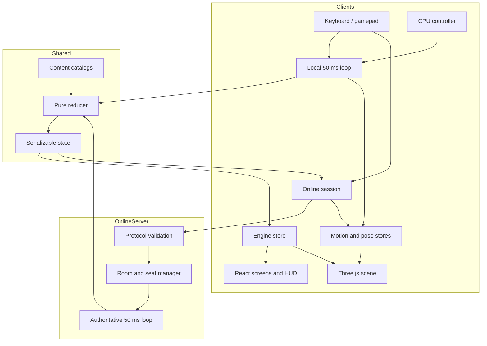
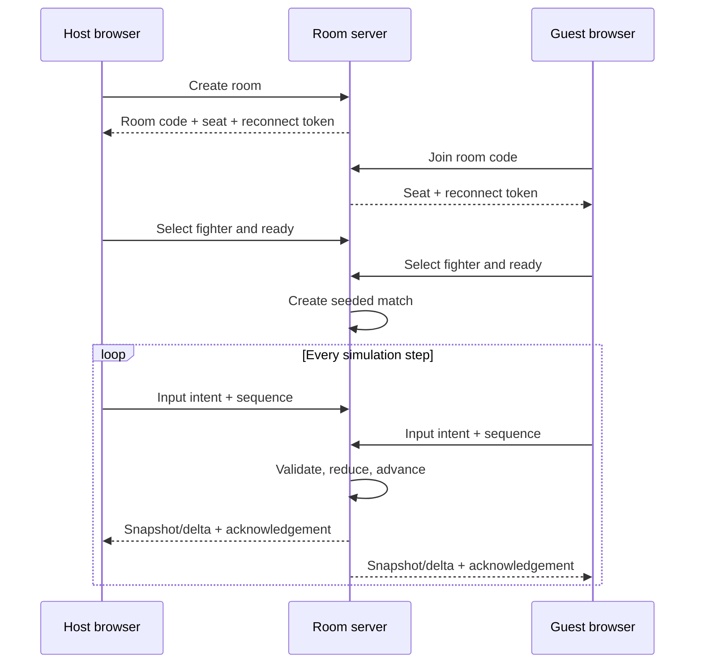

# System Design

Explosive Shinobi Arena separates game rules from input, networking, and
rendering. The same deterministic simulation powers campaign, training, local
battles, CPU players, replays, and online rooms.

## Design Goals

- One source of truth for every match.
- Repeatable outcomes from the same seed and action stream.
- Smooth rendering without tying game speed to frame rate.
- Untrusted online clients that send intent, never game state.
- Content that can grow without duplicating engine rules.

## Top-Level Design

```mermaid
flowchart TB
  subgraph Clients
    controls[Keyboard / gamepad]
    cpu[CPU controller]
    localLoop[Local 50 ms loop]
    onlineClient[Online session]
    store[Engine store]
    react[React screens and HUD]
    three[Three.js scene]
    cues[Motion and pose stores]
  end

  subgraph Shared
    reducer[Pure reducer]
    content[Content catalogs]
    state[Serializable state]
  end

  subgraph OnlineServer
    protocol[Protocol validation]
    room[Room and seat manager]
    serverLoop[Authoritative 50 ms loop]
  end

  controls --> localLoop
  cpu --> localLoop
  localLoop --> reducer
  controls --> onlineClient
  onlineClient --> protocol --> room --> serverLoop --> reducer
  content --> reducer
  reducer --> state
  state --> store
  state --> onlineClient
  localLoop --> cues
  onlineClient --> cues
  store --> react
  store --> three
  cues --> three
```

## State Ownership

| Mode | Authoritative state | Input path |
| --- | --- | --- |
| Campaign | Browser engine loop | Keyboard or gamepad |
| Training | Browser engine loop | Keyboard or gamepad |
| Local Arena | Browser engine loop | Humans and CPU controllers |
| Online Arena | Node room server | Validated WebSocket intent |

The reducer owns players, bombs, flames, pickups, monsters, bosses, hazards,
objectives, fog, the round clock, and results. React and Three.js only present
that state. Visual effects cannot award damage, move a player, or finish a
mission.

## Local Match Flow

1. The Mission Deck creates a serializable `GameConfig` and seed.
2. `engineLoop.ts` accepts movement and action intent.
3. It accumulates elapsed time and advances the reducer in fixed 50 ms steps.
   Frame gaps are capped, and no more than four simulation steps run per frame.
4. CPU controllers inspect state and submit the same actions as human players.
5. The engine store publishes once per display frame.
6. Narrow selectors update only the HUD or scene leaves whose data changed.
7. Motion tracks interpolate positions between simulation steps. Pose cues
   animate plants, hits, ultimates, and knockouts outside the reducer.

Seeded randomness is the only randomness inside a match. This keeps tests,
replays, CPU simulations, and online execution reproducible.

## Online Room Flow

```mermaid
sequenceDiagram
  participant A as Host browser
  participant S as Room server
  participant B as Guest browser

  A->>S: Create room
  S-->>A: Room code + seat + reconnect token
  B->>S: Join room code
  S-->>B: Seat + reconnect token
  A->>S: Select fighter and ready
  B->>S: Select fighter and ready
  S->>S: Create seeded match
  loop Every simulation step
    A->>S: Input intent + sequence
    B->>S: Input intent + sequence
    S->>S: Validate, reduce, advance
    S-->>A: Snapshot/delta + acknowledgement
    S-->>B: Snapshot/delta + acknowledgement
  end
```

The browser never sends a player ID, reducer action, or replacement state.
`src/network/protocol.ts` validates message shape and limits. The server assigns
seats, applies allowed intent, owns round advancement, and sends snapshots with
sequence acknowledgements.

A short disconnect pauses the room. A reconnect token restores the seat and
forces a full snapshot before play resumes. Rooms live in memory, so the current
deployment must use one server instance. Matchmaking, spectators, persistent
rooms, rollback prediction, and multi-region routing are future systems.

## Rendering

The renderer has three layers:

- **Static world:** floor, walls, crates, and stage landmarks use instanced
  meshes.
- **Actors:** fighters, enemies, bosses, bombs, pickups, and objectives use
  shared geometry and materials where possible.
- **Presentation:** HUD, labels, fog, telegraphs, camera framing, animation
  cues, and accessibility settings.

The simulation stores decimal grid coordinates. The scene maps `(x, y)` to
Three.js `(x, 0, y)` and samples motion tracks each frame. This makes movement
look continuous while collisions remain deterministic.

### Model Pipeline

Fighters are assembled from poseable Three.js primitives. Hair, clothing, and
accessories vary by fighter. Monsters and bosses use reusable part recipes;
their transformed pieces are merged once and cached. Pickups and objectives use
merged vertex-colored bodies.

The cel-shaded finish has two passes:

1. A shared three-band toon texture quantizes light.
2. One welded, back-facing hull per fighter expands along vertex normals to
   create a stable dark outline.

Archived GLB experiments are disabled in the shipping renderer. Keeping the
procedural path as the default gives predictable scale, silhouettes, animation,
load time, and draw-call cost.

## Performance Constraints

- Simulation: fixed 50 ms steps outside React.
- React: selector-based subscriptions and stable render-state identity.
- GPU: instancing, merged geometry, pooled materials, and cached textures.
- Shaders: a fixed pool of five point lights and countdown warmup.
- Canvas: no antialiasing, device pixel ratio capped at 1.35, demand rendering
  while paused or showing results.
- Loading: route-level lazy loading, a separate Three.js vendor chunk, and
  static first paint.
- Camera: gameplay is framed against measured HUD safe areas.

Performance work is checked on production builds. Useful signals are draw calls,
triangles, shader programs, late compiles, main-thread long tasks, React render
counts, and first-load timing. Reducer tests verify rules; scene tests verify
resource and rendering contracts; Playwright exercises real browser flows.

## Main Modules

| Path | Responsibility |
| --- | --- |
| `src/engine/` | State, reducer, rules, hazards, campaign, and seeded randomness |
| `src/ai/` | CPU decision-making through ordinary engine actions |
| `src/content/` | Data-driven stages, fighters, missions, enemies, and bosses |
| `src/hooks/engineLoop.ts` | Local fixed-step scheduler |
| `src/hooks/engineStore.ts` | State publication and selector subscriptions |
| `src/hooks/motionStore.ts` | Display interpolation tracks |
| `src/hooks/cueStore.ts` | Render-only animation cues |
| `src/network/` | Online protocol, browser session, reconnects, and replay |
| `server/` | Authoritative rooms, ticks, rate limits, and health check |
| `src/view/GameScreen/` | Match shell, HUD, camera, and 3D renderer |
| `src/view/GameScreen/scene/` | Instancing, lights, warmup, models, ink, and telegraphs |

## Deployment

Vite builds the static browser client. The Node service hosts WebSocket rooms
and `/healthz`. In `render.yaml`, the client receives the server URL through
`VITE_GAME_SERVER_URL`, and the server receives the allowed browser origin.
The online service must remain single-instance until rooms move to shared
storage or use sticky routing.
